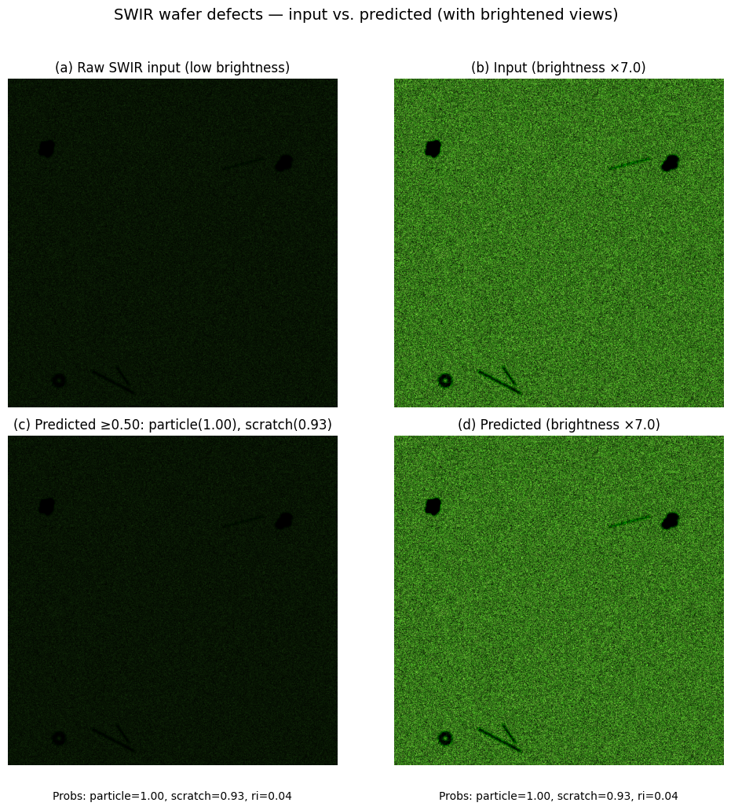

# wafer-defects-ml
Physics-inspired wafer defect detection: code and recipes to fine-tune a multi-label ResNet18, and classify particles, scratches, and refractive index halos based on short wave infrared upconverted microscope images.

THe below figures has 4 sub plots. The first column contains input (directly from experiments) and output images (from the trained resnet18 model). THe second column contains both the same images but brighter versions to show where the defects/contaminations are. With naked eye or camera, it is not possible to see the defects/contaminations from the experiments. 

The output classes of the model are written wlong with these subplots.

Fig 1

  

Fig 2

  

**Left column:** raw SWIR input and predicted output (labels shown under each).  
**Right column:** brightness-enhanced versions for human visibility.  
**Note:** SWIR captures are inherently low-brightness; some scratches are only visible via the model’s attention (e.g., Grad-CAM) and not to the naked eye.
